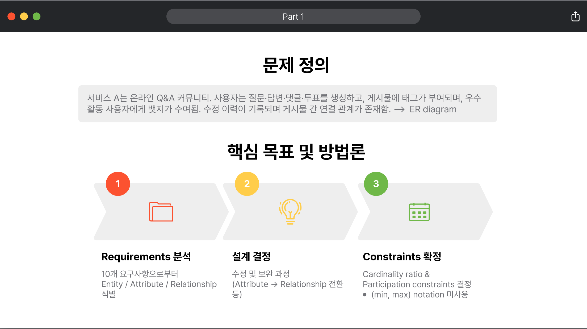
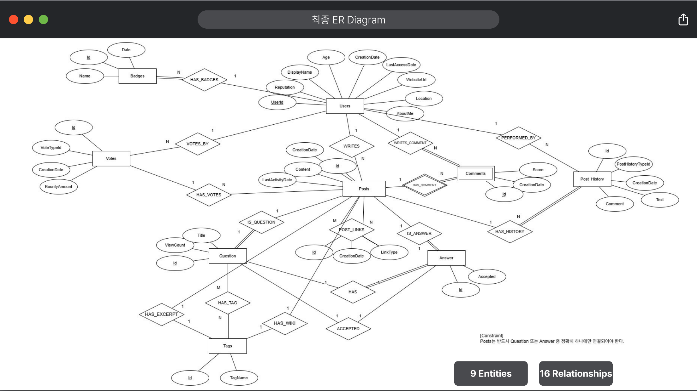
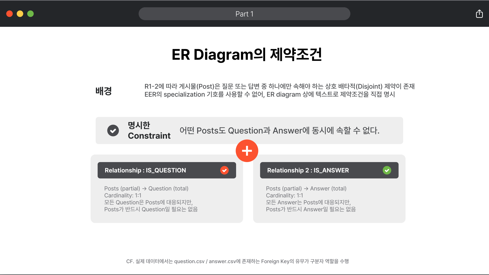
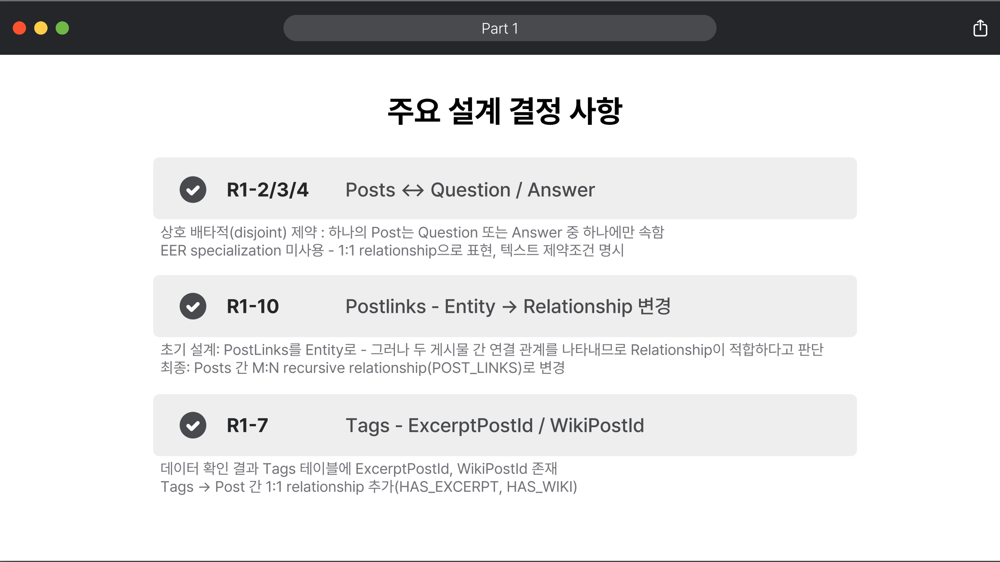
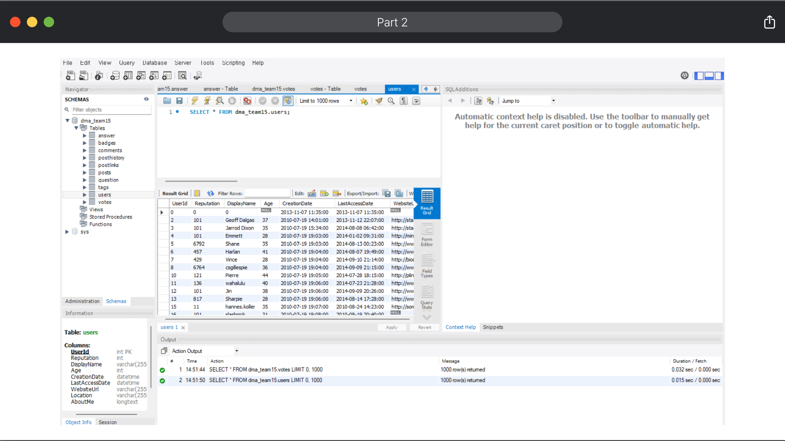
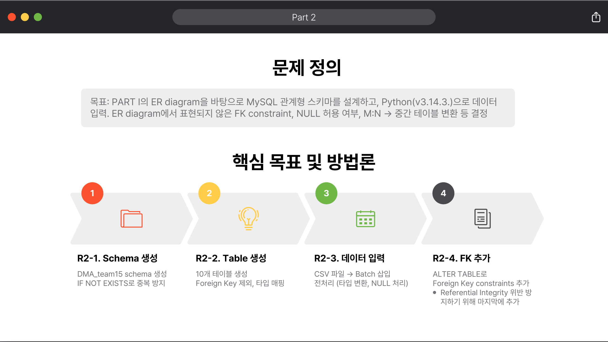

# Q&A 커뮤니티 데이터베이스 설계 및 구현

> Stack Overflow 형식의 온라인 Q&A 서비스를 위한 **관계형 데이터베이스 설계 및 MySQL 구현 프로젝트**
> 약 **103만 건**의 데이터를 10개 테이블에 적재하고, **1,727건의 중복 데이터를 탐지·처리**하여 무결성을 확보했습니다.


### 📊 한눈에 보는 주요 성과

| 적재 행 수 | 중복 처리 | FK 제약 | 모델링 결과 |
|:---:|:---:|:---:|:---:|
| **1,083,216** rows | **1,727**건 탐지·처리 | **16**개 | **9** Entities · **16** Relationships |

---

## 📑 목차

- [프로젝트 개요](#-프로젝트-개요)
- [본인 주도 기여](#-본인-주도-기여)
- [데이터 안내](#-데이터-안내)
- [데이터 규모](#-데이터-규모)
- [ER Diagram (최종)](#-er-diagram-최종)
- [주요 설계 결정](#-주요-설계-결정)
- [데이터 품질 분석 — 1,727건의 중복 탐지](#-데이터-품질-분석--1727건의-중복-탐지)
- [구현 하이라이트](#-구현-하이라이트)
- [데이터 분석 직무 관점에서의 핵심 역량](#-데이터-분석-직무-관점에서의-핵심-역량)
- [프로젝트 구조](#-프로젝트-구조)
- [실행 방법](#-실행-방법)
- [상세 자료](#-상세-자료)
- [기술 스택](#-기술-스택)
- [회고 및 개선 과제](#-회고-및-개선-과제)

---

## 📌 프로젝트 개요

| 항목 | 내용 |
|------|------|
| **과목** | 데이터관리와 분석 (2026-1학기) |
| **과제** | Project 1 — Conceptual DB Design & Implementation |
| **구성** | 2인 팀 프로젝트 |
| **기간** | 2026.03 ~ 2026.04 |

### 한 줄 요약

10개 요구사항을 분석해 **9개 Entity · 16개 Relationship**의 ER diagram을 도출하고,
이를 MySQL 관계형 스키마로 구현하여 **약 103만 건의 데이터를 10개 테이블에 적재**한 프로젝트입니다.
설계 과정에서 발견한 disjoint 제약, M:N recursive relationship, 데이터 중복 등의 이슈를
체계적으로 분석하고 해결한 점이 핵심입니다.

---

## 🙋 본인 주도 기여

2인 팀 프로젝트로 **전 단계에 공동 참여**했으며, 특히 다음 두 영역을 주도적으로 담당했습니다.

| 담당 영역 | 주요 내용 | 관련 섹션 |
|----------|----------|----------|
| **🧩 ER Diagram 설계** | 10개 자연어 요구사항을 **9 Entity · 16 Relationship**으로 정형화. Posts ↔ Question/Answer의 **disjoint 제약 표현 방식**과 PostLinks의 **M:N recursive relationship 재설계** 의사결정을 주도했습니다. | [주요 설계 결정](#-주요-설계-결정) |
| **🐍 데이터 적재 Python 코드 작성** | 약 **103만 행**을 안정적으로 적재하기 위한 **3단계 fallback 구조**(1,000건 단위 배치 삽입 → 오류 시 단건 재삽입 → 그래도 오류 시 해당 행 미삽입)를 설계·구현했습니다. 이 구조 덕분에 comments 테이블의 **중복 1,727건도 데이터 손실 최소화 방식**으로 처리할 수 있었습니다. | [구현 하이라이트](#-구현-하이라이트) |

---

## 📦 데이터 안내

> ⚠️ **원본 데이터는 본 저장소에 포함되어 있지 않습니다.**
> 사용한 데이터셋은 학교 강의 과제용으로 제공된 자료로, 라이선스 정책상 재배포가 불가합니다.
> 본 저장소에는 **설계 문서·구현 코드·결과 요약**만 포함되어 있습니다.

### 데이터 구성 (참고용)

총 10개의 csv 파일로 구성되었으며, 각 파일의 컬럼 구조는 아래와 같습니다.

| 파일 | 주요 컬럼 |
|------|----------|
| `users.csv` | UserId, Reputation, DisplayName, Age, CreationDate, LastAccessDate, ... |
| `posts.csv` | Id, CreationDate, Content, OwnerUserId, LastActivityDate |
| `question.csv` | Id, PostId, AcceptedAnswerId, ViewCount, Title, Tags |
| `answer.csv` | Id, PostId, Accepted, ParentId |
| `comments.csv` | Id, PostId, Score, CreationDate, UserInfoId |
| `votes.csv` | Id, PostId, VoteTypeId, CreationDate, UserInfoId, BountyAmount |
| `tags.csv` | Id, TagName, ExcerptPostId, WikiPostId |
| `badges.csv` | Id, UserInfoId, Name, Date |
| `postHistory.csv` | Id, PostHistoryTypeId, PostId, CreationDate, UserInfoId, Text, Comment |
| `postLinks.csv` | Id, CreationDate, PostId, RelatedPostId, LinkTypeId |

---

## 🗂 데이터 규모

10개 csv 파일을 분석하고 적재했습니다.

| 테이블 | 원본 행 수 | 적재 행 수 | 비고 |
|--------|-----------:|-----------:|------|
| users | 40,325 | 40,325 | — |
| posts | 91,977 | 91,977 | — |
| question | 42,921 | 42,921 | — |
| answer | 47,756 | 47,756 | — |
| **comments** | **171,467** | **169,740** | **🚨 중복 1,727건 처리** |
| votes | 323,233 | 323,233 | — |
| tags | 1,032 | 1,032 | — |
| badges | 79,851 | 79,851 | — |
| postHistory | 275,281 | 275,279 | 이상치 2건 |
| postLinks | 11,102 | 11,102 | — |
| **합계** | **1,084,945** | **1,083,216** | — |

---

## 🧩 ER Diagram (최종)

ER diagram 도식화는 3단계 프로세스로 진행했습니다.
**① Requirements 분석** (Entity·Attribute·Relationship 식별) →
**② 설계 결정** (수정·보완) →
**③ Cardinality / Participation Constraints 확정**



위 프로세스를 거쳐 도출한 최종 ER diagram은 다음과 같습니다.



> **9 Entities · 16 Relationships** —
> Users · Posts · Question · Answer · Comments(Weak Entity) · Votes · Tags · Badges · PostHistory

---

## 💡 주요 설계 결정

### 1. Posts ↔ Question / Answer의 **상호 배타적(Disjoint) 제약**

게시물은 질문 또는 답변 중 하나에만 속해야 하지만,
프로젝트 제약상 EER의 specialization 기호를 사용할 수 없었습니다.

→ **1:1 Relationship 2개(IS_QUESTION, IS_ANSWER) + 텍스트 제약조건**으로 논리적 배타성을 표현하고,
실제 데이터에서는 `question.csv` / `answer.csv`의 FK 존재 여부 자체가 구분자 역할을 수행하도록 설계했습니다.



### 2. PostLinks: **Entity → M:N Recursive Relationship**으로 재설계

초기에 PostLinks를 독립 Entity로 설계했으나, 다음 이유로 **Posts 간의 M:N recursive relationship**으로 변경했습니다.

- PostLinks는 독립적 존재 의미보다 **두 게시물 간 연결 관계** 자체의 성격이 강함
- 모든 속성이 두 Posts의 조합으로 결정 가능
- Entity로 두면 불필요한 중간 단계로 모델 복잡도가 증가

### 3. Tags ↔ Posts의 1:1 보조 관계 추가

데이터의 `ExcerptPostId`, `WikiPostId` 컬럼을 발견하고,
`HAS_EXCERPT`, `HAS_WIKI` 두 개의 1:1 Relationship을 추가하여 ER diagram에 반영했습니다.



---

## 🔍 데이터 품질 분석 — 1,727건의 중복 탐지

`comments.csv`를 검토하던 중 **동일 `PostId` 내 동일 `Id`를 가지는 레코드가 1,727건** 존재함을 확인했습니다.

이는 요구사항 (R1-5)의 *"게시물 내 댓글 순번"* 해석과 부합하지 않는 이상 데이터로,
Weak Entity로 모델링한 Comments의 **복합키 `(Id, PostId)` 제약**과 충돌합니다.

**처리 원칙:** R2-3 요구사항(csv 파일을 직접 변형하지 않을 것)을 준수하기 위해,
원본 데이터를 임의로 수정하지 않고 **중복 행을 적재 단계에서 미삽입**하는 방식을 선택했습니다.

결과적으로 `comments` 테이블 적재 건수는 171,467 → 169,740으로 감소했으며,
데이터 손실 가능성을 보고서에 명시하여 후속 개선 과제로 남겼습니다.



---

## 🛠 구현 하이라이트

### Part 2 진행 단계

ER diagram을 바탕으로 MySQL 관계형 스키마를 설계하고, 다음 4단계로 구현했습니다.



### 주요 구현 포인트

#### ① 1:1 Relationship의 UNIQUE 제약 매핑

```sql
CREATE TABLE question (
    Id INT(11) NOT NULL,
    PostId INT(11) NOT NULL,
    AcceptedAnswerId INT(11),
    ...
    PRIMARY KEY (Id),
    UNIQUE (PostId),              -- IS_QUESTION (1:1)
    UNIQUE (AcceptedAnswerId)     -- ACCEPTED (1:1, nullable)
);
```

#### ② 대용량 데이터 적재 — Fallback 배치 삽입 전략

10개 테이블 약 103만 행을 안정적으로 적재하기 위해 **3단계 fallback 구조**를 적용했습니다.

```python
def flush(cursor, cnx, sql, batch):
    if batch:
        try:
            # 1차: 1,000건 단위 빠른 배치 삽입
            cursor.executemany(sql, batch)
        except mysql.connector.Error:
            # 2차: rollback 후 한 줄씩 재시도
            cnx.rollback()
            for row in batch:
                try:
                    cursor.execute(sql, row)
                except mysql.connector.Error:
                    # 3차: 불량 데이터 1건 skip 후 계속
                    pass
        cnx.commit()
```

→ 성능(executemany)과 안정성(개별 행 fallback)을 모두 확보.
불량 데이터로 인한 전체 적재 실패를 방지합니다.

#### ③ Foreign Key는 데이터 적재 이후 추가

Referential Integrity 위반을 방지하기 위해
**스키마 생성 → 데이터 적재 → FK 제약 추가** 순으로 진행 (총 16개 FK).

```python
fk_queries = [
    'ALTER TABLE posts ADD FOREIGN KEY (OwnerUserId) REFERENCES users(UserId)',
    'ALTER TABLE question ADD FOREIGN KEY (PostId) REFERENCES posts(Id)',
    # ... 총 16개
]
```

---

## 🧠 데이터 분석 직무 관점에서의 핵심 역량

이 프로젝트에서 다음 역량을 학습하고 적용했습니다.

| 역량 | 적용 사례 |
|------|-----------|
| **SQL · 관계형 모델링** | ER diagram → MySQL 물리 스키마 변환, 16개 FK 제약 설계 |
| **데이터 품질 검증** | comments 테이블 중복 1,727건 탐지 및 처리 방침 결정 |
| **대용량 데이터 처리** | 약 103만 행을 fallback 배치 전략으로 안정 적재 |
| **요구사항 분석** | 10개 자연어 요구사항을 9 Entity · 16 Relationship으로 정형화 |
| **설계 의사결정** | Disjoint 제약, M:N recursive 등 trade-off 분석 후 선택 |
| **재현 가능한 코드** | Python + mysql-connector 만으로 전 과정 자동화 |

---

## 📁 프로젝트 구조

```
DMA-project-1-/
├── README.md                              # 본 문서
├── DMA_project1_team15.py                 # Python 구현 코드 (4 requirements)
├── DMA_project1_team15_report.pdf         # 기술 보고서 (ERD 설계 근거, 스키마 정의, 의사결정)
├── DMA_project1_team15_summary.pdf        # 발표자료 (요약본)
└── figures/                               # README용 시각 자료
    ├── 01_erd_final.png
    ├── 02_disjoint_constraint.png
    ├── 03_design_decisions.png
    ├── 04_part2_methodology.png
    ├── 05_data_cleaning.png
    └── 06_part1_methodology.png
```

### 코드 구조 (`DMA_project1_team15.py`)

| 함수 | 역할 | 대응 요구사항 |
|------|------|--------------|
| `requirement1()` | 스키마 `DMA_team15` 생성 | R2-1 |
| `requirement2()` | 10개 테이블 생성 (타입 매핑 · UNIQUE 제약) | R2-2 |
| `requirement3()` | csv 파일 적재 (전처리 · 배치 삽입) | R2-3 |
| `requirement4()` | Foreign Key 제약 추가 (총 16개) | R2-4 |

---

## 🚀 실행 방법

> ⚠️ 본 저장소에는 원본 csv 데이터가 포함되어 있지 않습니다.
> 직접 재현하려면 동일한 컬럼 구조의 csv 파일 10개를 별도로 준비해야 합니다.

### 1. 사전 요구사항

- Python 3.x
- MySQL 8.x

### 2. 의존성 설치

```bash
pip install mysql-connector-python
```

### 3. DB 접속 정보 설정

`DMA_project1_team15.py`의 MySQL 연결 정보(host, user, password 등)를 본인 환경에 맞게 수정합니다.

### 4. 실행

```bash
python DMA_project1_team15.py
```

순차적으로 다음 4단계가 수행됩니다.

1. `DMA_team15` 스키마 생성 (R2-1)
2. 10개 테이블 생성 + UNIQUE 제약 (R2-2)
3. csv 파일 적재 — 1,000건 단위 배치 + 단건 fallback (R2-3)
4. Foreign Key 16개 추가 (R2-4)

---

## 📄 상세 자료

- 📘 [기술 보고서 (PDF)](DMA_project1_team15_report.pdf) — ER diagram 설계 근거, 카디널리티 결정 근거, 전체 스키마 정의
- 📊 [발표자료 (PDF)](DMA_project1_team15_summary.pdf) — 핵심 요약 및 의사결정 정리

---

## 🛠 기술 스택

- **Database:** MySQL 8.x
- **Language:** Python 3.14
- **Libraries:** `mysql-connector-python`, `csv` (표준 라이브러리)
- **Modeling Tool:** draw.io

---

## 🔄 회고 및 개선 과제

- **잘된 점:** Requirements 분석 단계에서 발견하지 못했던 disjoint 제약과 M:N recursive 관계 등의 이슈를, 설계·구현 과정에서 단계적으로 발견하고 해결했습니다. 특히 데이터 적재 단계에서 우연히 발견한 1,727건 중복은 설계의 정합성을 검증하는 계기가 되었습니다.
- **아쉬운 점 / 향후 개선:**
  - Posts-Question-Answer 간의 상호 배타성을 ER diagram만으로 표현하지 못해 텍스트 제약조건으로 보완 → EER 표기법 활용 시 더 완전한 표현 가능
  - 중복 데이터 미삽입으로 인한 손실 발생 → 사전 EDA 단계를 추가하여 원본 데이터 이상치를 더 일찍 발견·처리하는 프로세스 도입 필요

---

## 📜 License

본 저장소의 **소스 코드 및 문서**는 학습/포트폴리오 목적으로 공개됩니다.
**원본 데이터셋**은 학교 과제 자료로서 본 저장소에 포함되어 있지 않습니다.
